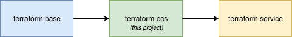

# Setting up an AWS ECS cluster using Terraform

The following project deploys an ECS cluster to AWS.

If you worked through [Part 1](https://medium.com/@brendanspinks/terraform-on-aws-using-remote-state-backends-with-workspaces-7e0f2f341b2b) you will have a base project that this project builds on top of.

Using the base project is not required, however in internal Route53 zone will need to be created externally, as well as a working AWS VPC with subnets and internet connectivity.

The way that we organise Terraform projects is to start from a base project and then build of the top of that. This project is built on top of the base project and a following project will build on top of this one.

### Architecture



# Setting up

### Helper script

Within the project I have written a helper script called `run.sh`, it is very simple but will ensure that you always use the correct workspace with the accompanying variables file. It can be use like this:

It also uses an AWS profile matching the workspace name.

```sh
./run.sh plan prod
```

The above example will run a terraform plan on the prod workspace. It looks in the `workspace-variables` directory for a variable file called `prod.tfvars`, the same name as we used for the workspace.

The `run.sh` is very basic and currently does not support extra parameters. Basic useage of terraform `plan`, `apply` and destroy work fine.

If you don't want to use the run script, you can see the command that we use to run terraform in the script itself.

# Configuration

As mentioned above, we provide and override variables with a file matching the name of our workspace in the `workspace-variables` directory. An example would look like this:

```
zone_name = "oculo"
ecs_cluster_name = "services"

vpc_id = "vpc-example"
availability_zones = "ap-southeast-2a,ap-southeast-2c"
subnet_ids = "subnet-example1,subnet-example2"
cidr_blocks = "10.0.0.0/16"
scaling_min_size=1
scaling_max_size=3
scaling_desired_capacity=2
```

# Deploying our infrastructure

```sh
./run.sh plan yourworkspacename
```

If this all works as expected with no errors you can then apply the changes.

```
./run.sh apply yourworkspacename
```

You should see something like the following:

```sh
Apply complete! Resources: x added, 0 changed, 0 destroyed.
```

# Continuing on

To deploy a service to your new cluster, see this [project](https://github.com/CERATechnologies/terraform-ecs-clamav).

